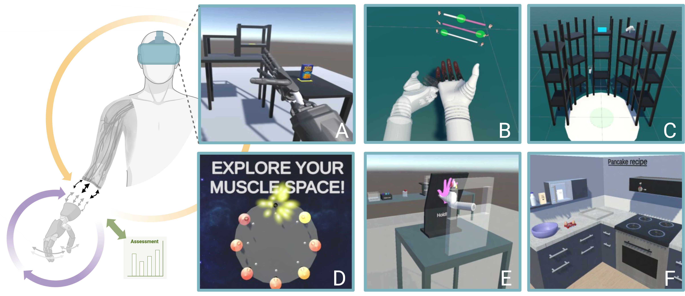

# PAVE — Prosthetic Assessment and Learning in Virtual Environments

<div align="center">

# 🚧 WORK IN PROGRESS 🚧

**PAVE is an actively developed research prototype. The project is not yet plug-and-play, APIs and scenes may change.**

</div>

PAVE is a collection of physics-based virtual environments for developing, training, and assessing upper-limb prosthetic control. It provides a shared Unity and MuJoCo testbed in which a prosthesis user, a myoelectric controller, and the task environment can adapt to and inform one another during closed-loop interaction.

The project is motivated by a practical problem in myocontrol research: conventional screen-guided calibration and offline accuracy do not fully represent goal-directed prosthesis use. Physical assessments are valuable, but they can require specialized hardware, space, and study-specific setups. PAVE complements them with accessible and reproducible virtual tasks that support realistic object interaction, controlled experimental manipulation, and synchronized performance logging.

<p align="center">
  
</p>

<p align="center"><em>
Overview of the current PAVE suite. A: Pasta Box environment. B–C: HIL-IL target-matching, limb-position, and object-interaction environments. D–E: unsupervised incremental-learning environments for muscle-space exploration and co-adaptation. F: activities-of-daily-living kitchen environment. Created in BioRender. F. Egle (2026). <a href="https://BioRender.com/7dqd544">https://BioRender.com/7dqd544</a>.
</em></p>

## Research goals

PAVE is designed to support research on:

- human-in-the-loop and co-adaptive myoelectric control;
- user learning and incremental model learning;
- environment-dependent learning from task context, pseudo-labels, or rewards;
- simultaneous and proportional control of multiple prosthetic degrees of freedom;
- functional training and assessment in activities resembling daily living;
- control reliability, workload, embodiment, agency, trust, and gaze behavior; and
- repeatable collection of task, interaction, collision, and controller data.

The virtual environment is therefore more than a visualization layer. A PAVE scene can define the task, provide feedback to the user, measure behavior, and return contextual information to an external control pipeline.

```text
sEMG / other sensors
        │
        ▼
external myocontrol pipeline
  (for example LibEMG or MOSAIC)
        │ predictions
        ▼
    UDP / SIM interface
        │
        ▼
 Unity scene + MuJoCo physics ───► virtual prosthesis and task feedback
        │
        └── task context, pseudo-labels, rewards, and logged outcomes ──► pipeline
```

## What is currently in this repository?

The Unity project is located in [`PAVE_unity`](PAVE_unity). The repository currently contains the following principal scenes:

| Scene | Intended role |
| --- | --- |
| `HIL-IL_TAC_VR.unity` | Target-achievement-style control with a virtual prosthesis and target pose; a comparatively controlled, low-interaction environment for training and assessment. |
| `HIL-IL_VR.unity` | Immersive human-in-the-loop incremental-learning tasks involving limb-position variation and object interaction. |
| `PastaBox.unity` | Physics-based Pasta Box Task for functional performance and reliability-oriented prosthesis research. |
| `ShadowHand_only.unity` | Development/reference scene for the virtual prosthetic hand. |
| `SampleScene.unity` | Unity template/development scene; currently the only scene enabled in the checked-in Build Settings. |

Shared code is organized under `PAVE_unity/Assets/Scripts`, including components for communication, logging, collision handling, MuJoCo interactions, scene management, UI, and XR.

The broader PAVE concept also encompasses environments for unsupervised incremental learning, muscle-space exploration, co-adaptation training, and activities-of-daily-living assessment in a virtual kitchen. These environments are part of the ongoing research roadmap and are not all included in the current public repository.

## Core features

- Unity-based immersive and non-immersive task environments
- MuJoCo-based contact dynamics and virtual sensing
- A virtual upper-limb prosthesis with modular actuation, based on the MuJoCo Hannes hand model by [Pasquali et al.](https://amsacta.unibo.it/id/eprint/8520/)
- Support for three principal actuated degrees of freedom:
  - hand opening/closing;
  - wrist flexion/extension; and
  - wrist pronation/supination
- Real-time communication with external control pipelines over UDP
- Task-derived context for pseudo-label- or reward-based learning
- Centralized event and performance logging
- OpenXR, Meta/Oculus, and XR Interaction Toolkit packages
- Assets for HTC Vive tracking

Individual scenes may implement only a subset of these features.

## Requirements

The project currently targets:

- **Unity 2022.3.42f1 LTS**
- **[MuJoCo for Unity 3.3.3](https://mujoco.readthedocs.io/en/3.3.3/unity.html)** — the checked-in manifest points to a local MuJoCo `3.3.3` Unity package
- **[`mj-unity-extensions`](https://github.com/Balint-H/modular-agents/tree/main/mj-unity-extensions)** — used for additional MuJoCo/Unity functionality
- a Windows PC suitable for Unity VR development
- a compatible OpenXR headset and tracking setup for immersive scenes
- an external myocontrol pipeline for experiments driven by biosignals

The project includes integrations intended for [LibEMG](https://github.com/LibEMG/libemg), [MOSAIC](https://doi.org/10.1109/ACCESS.2025.3644237), and the [Streamlined Input Manager (SIM)](https://doi.org/10.5281/zenodo.15707420) UDP protocol. The exact sensor, headset, tracker, and pipeline configuration depends on the selected experiment.

## Installation

### 1. Get the repository

```bash
git clone https://github.com/AIROB-Lab/PAVE---Prosthetic-Assessment-and-Learning-in-Virtual-Environments.git
cd PAVE---Prosthetic-Assessment-and-Learning-in-Virtual-Environments
```

### 2. Install the required Unity version

Install Unity `2022.3.42f1` through Unity Hub. Add the Windows build support module if you intend to create a standalone Windows build.

### 3. Resolve the local Unity packages

The current [`PAVE_unity/Packages/manifest.json`](PAVE_unity/Packages/manifest.json) contains machine-specific `file:` references for:

- [`org.mujoco`](https://mujoco.readthedocs.io/en/3.3.3/unity.html)
- [`com.github.mj-unity-extensions`](https://github.com/Balint-H/modular-agents/tree/main/mj-unity-extensions)

Install or obtain those packages locally, then replace the two absolute paths in `manifest.json` with paths valid on your machine. Unity cannot import the project cleanly until both references resolve.

## Research background

PAVE brings several lines of work into a common family of environments:

- **HIL-IL VR:** target matching, limb-position variation, and object-transfer tasks for human-in-the-loop incremental learning;
- **unsupervised co-adaptation:** initialization, repeated physics-based training, and later assessment in daily-living tasks; and
- **Pasta Box assessment:** a repeatable object-transfer task for investigating functional performance and the perceptual consequences of altered controller reliability.

Initial pilot work supports the technical feasibility of using physics-based VR for these questions, but it does not establish general clinical effectiveness. Results have also highlighted challenges such as participant-specific learning trajectories, sensitivity to task-derived rewards or pseudo-labels, and the need to distinguish user learning from model adaptation.

### Unsupervised co-adaptation work by Lisa Robra and collaborators

Lisa Robra developed and evaluated the unsupervised incremental-learning branch of PAVE as part of her 2025 master's thesis, *Development of a Virtual Reality Environment Using Robotic Simulations in Order to Train and Test Unsupervised Upper Limb Prosthesis Control*. This work was subsequently extended into the accepted 2026 paper *A Recipe for Unsupervised Myocontrol — Co-Adaptive Training and Assessment in Physics-Based VR* by Robra et al.

This branch combines an incremental non-negative matrix factorization (iNMF) controller with a Unity and MuJoCo virtual prosthesis. Its workflow comprises three stages:

1. **Initialization and muscle-space exploration:** participants explore muscle activations and establish the initial iNMF model.
2. **Closed-loop co-adaptation training:** the user and controller adapt during repeated physics-based tasks targeting hand closing, wrist pronation/supination, wrist extension, and wrist flexion.
3. **Myocontrol assessment:** the trained controller is used in a virtual kitchen containing a sequence of activities-of-daily-living tasks based around preparing pancakes.

A pilot study with five participants assessed task completion and duration, model reconstruction error, and perceived workload using NASA-TLX. Across repetitions, virtual-task performance improved. Incrementally updated models generally reconstructed later activities-of-daily-living data better than the initialization model, although trajectories differed between participants. Workload tended to decline with longer training and increased for the more complex kitchen tasks. These findings support the feasibility of the approach but do not establish clinical effectiveness.

The study used a Meta Quest 3 with Touch Pro controllers, Unity `2022.3.42f1`, and MuJoCo `3.2.7`. Public integration and documentation of these unsupervised-learning scenes are still work in progress.

### Virtual Hannes prosthesis

The PAVE environments use a sensorized MuJoCo model of the Hannes prosthetic hand made available by Pasquali et al. through the University of Bologna's AMS Acta repository. The model reproduces the hand's joint kinematics and actuation principles and provides the physics-based virtual prosthesis used for actuation, contact interaction, and sensing. The archived model is distributed under [CC BY-NC-ND 4.0](https://creativecommons.org/licenses/by-nc-nd/4.0/); consult its record and license before reuse.

## Related publications

If you use PAVE, please cite the publication associated with the environment or protocol you use. Citation information will be updated as the project matures.

- F. Egle *et al.*, “Reliability in Focus: Trust, Agency, Ownership, and Gaze Behavior in a VR Prosthesis Simulator,” *IEEE Transactions on Neural Systems and Rehabilitation Engineering*, vol. 34, pp. 1895–1907, 2026. [doi:10.1109/TNSRE.2026.3676703](https://doi.org/10.1109/TNSRE.2026.3676703)
- L. Robra *et al.*, “A Recipe for Unsupervised Myocontrol — Co-Adaptive Training and Assessment in Physics-Based VR,” *IEEE RAS/EMBS International Conference on Biomedical Robotics and Biomechatronics*, accepted, 2026.
- F. Egle *et al.*, “HIL-IL VR — Development of a Virtual Reality Setup for Human-in-the-Loop Incremental Learning in Myocontrol,” *International Conference on NeuroRehabilitation (ICNR)*, accepted, 2026.
- A. Pasquali, D. Bargellini, R. Meattini, G. Palli, C. Gentile, E. Gruppioni, N. Boccardo, and M. Laffranchi, “INTELLIMAN. WP4. Adaptive Shared Autonomy. T4_3. Advanced Human-Robot Interaction Modalities. Hannes Prosthetic Hand MuJoCo Model. v0,” University of Bologna, 2025. [doi:10.6092/unibo/amsacta/8520](https://doi.org/10.6092/unibo/amsacta/8520)

## Contributing

PAVE is still being reorganized for broader reuse. Bug reports, documentation improvements, and well-scoped contributions are welcome through [GitHub Issues](https://github.com/AIROB-Lab/PAVE---Prosthetic-Assessment-and-Learning-in-Virtual-Environments/issues).

When reporting a problem, please include:

- operating system and Unity version;
- headset, runtime, and tracker hardware;
- MuJoCo and `mj-unity-extensions` versions;
- the affected scene;
- relevant Unity Console output; and
- steps needed to reproduce the issue.

Please do not include participant data, biosignals, or other sensitive study data in an issue.

## Acknowledgements

PAVE is being developed at the [AIROB Lab](https://www.airob.org/) together with research collaborators.

The project uses the MuJoCo physics engine, Unity XR tooling, the virtual Hannes hand model by [Pasquali et al.](https://amsacta.unibo.it/id/eprint/8520/), and `mj-unity-extensions` from the modular-agents project.
